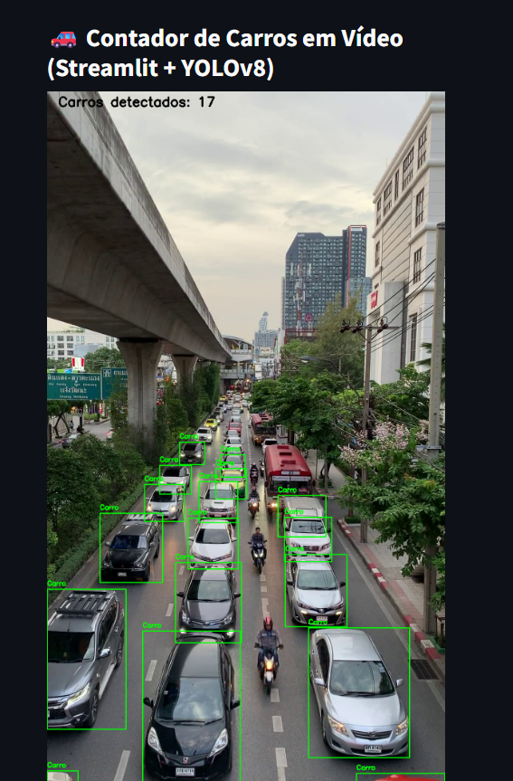

# 🚗 Contador de Carros com Visão Computacional

Este projeto usa **YOLOv8** (modelo pré-treinado da Ultralytics) para detectar e contar **apenas carros** (ignorando ônibus, motos etc.) em um vídeo de trânsito. A contagem é exibida em **tempo real** com uma interface criada em **Streamlit**.

## 📸 Exemplo



---

## 📦 Requisitos

- Python 3.8+
- OpenCV (`cv2`)
- Ultralytics (YOLO)
- Streamlit

### Instale os requisitos:

```bash
pip install -r requirements.txt

